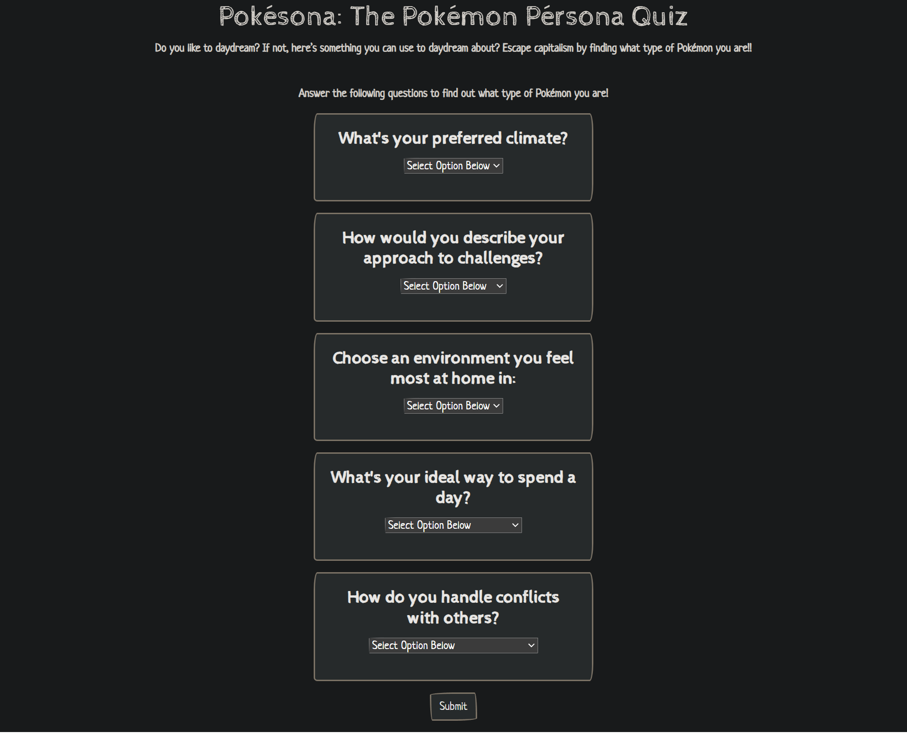
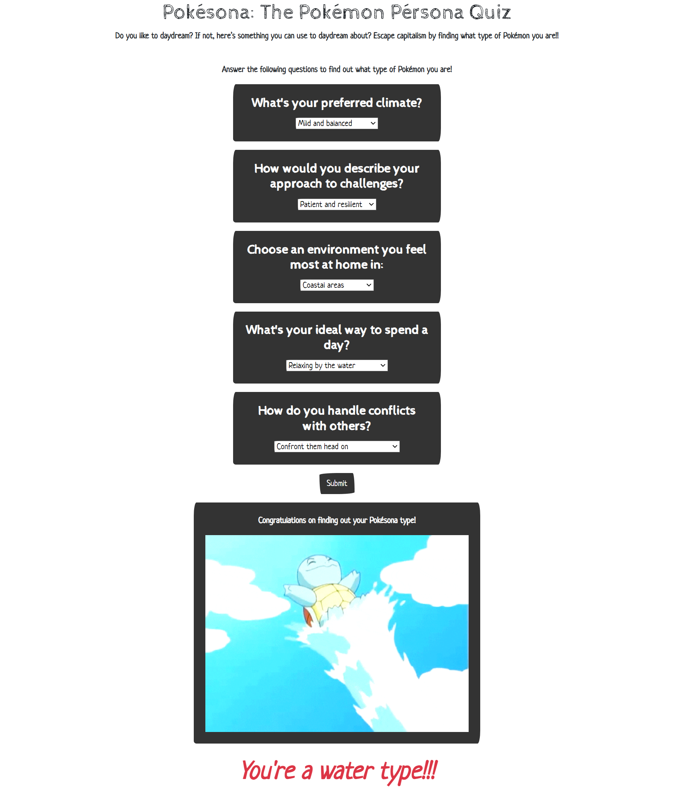

# Pokesona Quiz - Project

## Description
This application presents webpage users with the option to assess what type their Pokesona (Pokemon Persona) is based on their responses to our questionnaire. Depending on the ratio specific "type" answers the user's Pokemon type will be determined, and dynamically displayed to the web page. Each answer is assigned to a Pokemon type and the outcome is determined by the ratio of types in their responses. This project employs the use of Server-Side APIs to retrieve Pokemon data and Giphy images using the fetch method. Local Storage is used to store the user's previous answers to the quiz. 

## Credits
Shyla - https://github.com/sailorshy94  
Jesse - https://github.com/jesse-howell  
Daymen - https://github.com/DaymenPasick  

## Technology Used
Webpage styling: bootswatch-Sketchy Theme  

APIs Used:  
1) PokeApi https://pokeapi.co/  
2) Giphy https://developers.giphy.com/docs/api/  

## Screenshot

## Link
[Link To URL](https://jesse-howell.github.io/pokesona-project/)